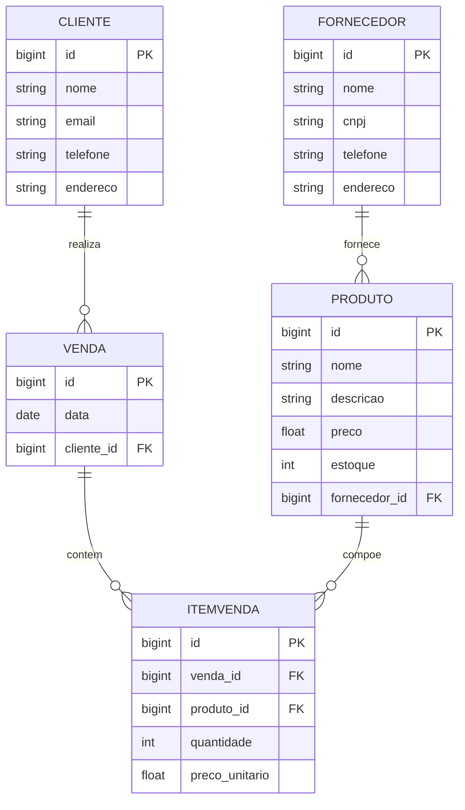

# Loja de Produtos Diversos - Em Desenvolvimento

Este é um projeto em desenvolvimento de uma **Loja de Produtos Diversos** utilizando o framework **Spring Boot**. A aplicação tem como objetivo a gestão de fornecedores, clientes, produtos, vendas e itens de venda. Está sendo desenvolvido com o banco de dados **H2** em memória, facilitando os testes e o desenvolvimento.

## Diagrama ERD (Entidade-Relacionamento)

