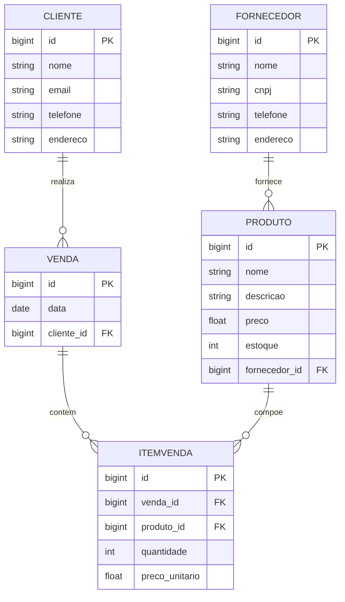

# Loja de Produtos Diversos 
Este é um projeto simples, desenvolvido apenas para fins de estudo, aplicando o que aprendi até o momento sobre uma Loja de Produtos Diversos utilizando o framework **Spring Boot**. A aplicação tem como objetivo a gestão de fornecedores, clientes, produtos, vendas e itens de venda. E foi desenvolvida como parte dos meus estudos para colocar em prática conceitos de desenvolvimento backend, utilizando o banco de dados **PostgreSQL** para simular um ambiente mais próximo do real.

## Diagrama ERD (Entidade-Relacionamento)

